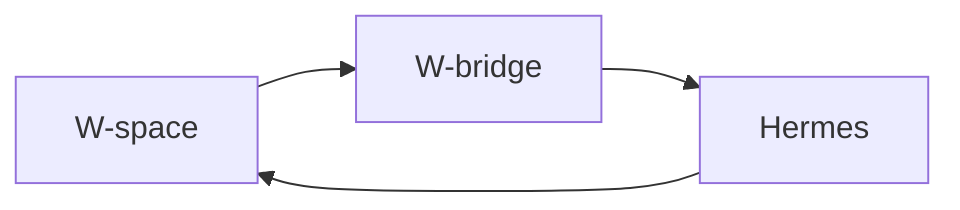
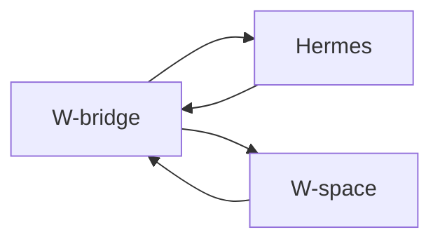

#### MCP

**W-space** or **W-bridge** 

##### MCP on W-space

#### MCP on W-bridge

## Knowledge

1. W-bridge & Obisidian 
2. W-bridge & Memory heirarchy
3. Normal vs Knowledge
4. Do we need sliding windows?

## Cron

1. Company status
2. Project Overview
3. Project all-hands
4. Project knowledge
5. Inside room crone for actions
6. Knowledge distillation crone

## Queue & Task scheduling

* Are different event tasks required different queue?
* Different event have different processing priority?

## W-space ping mechanism

1. **Hook events**: Just ping the W-space to check for new messages
2. **Long polling**:Long pooling for getting new messages
3. **Push events**: Send all events with detail to the W-space, and let the W-space decide what to do with it.

## Integration type 
Between W-space and W-bridge, we can have two types of integration:
1. **Database**: sharing sqlite database between W-space and W-bridge, and let the W-space to query the database for new messages.
2. **API**: W-bridge use api to get additional information from the W-space.

## API structure

### the W-bridge

#### Fuzzy match on sending action

### the W-space

## Agent

## Retry

### Hermes retry mechanism

### Persistance of tasks

### W-space retry mechanism

## Progress